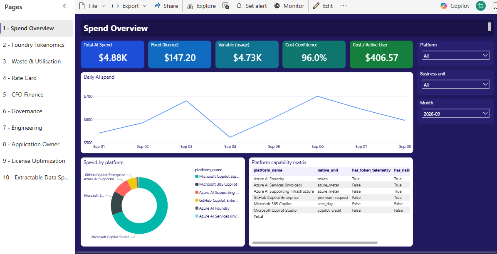
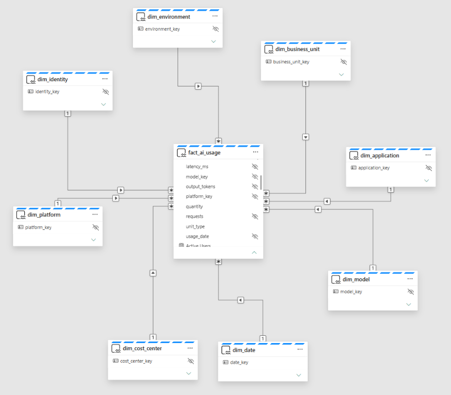

# AI FinOps & Tokenomics — Power BI PoC

A working Power BI Project (PBIP) showing unified AI spend across **Microsoft 365 Copilot**,
**Copilot Studio**, **GitHub Copilot Enterprise**, and **Azure AI Foundry**.

Some slices are real, some are modelled. **Which is which is a first-class column in the
model** (`dim_platform[data_source]`) rather than a footnote, because the difference between
billed and modelled dollars is the single most important thing to be honest about in an AI
FinOps conversation. In this fork that column is *derived* from the bronze lineage, so the
label always follows the data.

> **Want the runnable demo (persona dashboards + AI layer, no Fabric/license)?**
> See **[RUNBOOK.md](RUNBOOK.md)** — clone, run two commands, open http://localhost:8080.



---

## What this fork adds

This is a fork of [`natesanshreyas/ai-finops-powerbi`](https://github.com/natesanshreyas/ai-finops-powerbi).
Upstream proves the *shape* of the model against a mock feed plus one real Foundry
slice. This fork wires a **live Azure / Graph / Dataverse extract path** alongside
that mock feed and runs the whole thing on **Direct Lake in Fabric**, so the report
shows genuinely invoiced AI spend beside modelled spend — with provenance still
derived from the data rather than hand-written.

Verified end to end against a live tenant: **$5,809.81** of invoiced Azure spend over
91 days, 694 Entra identities, 144 applications, 8 Copilot Studio agents.

**Real and mock never share a lakehouse.** The separation is physical, not a column
filter, so "which of these numbers is real" is answered by pointing at storage:

```
bronze       (MOCK)  ─┐
                      ├─►  silver  ─►  gold  ─►  Direct Lake model ─► 10-page report
bronze_real  (REAL)  ─┘
```

Silver unions both and carries `_data_class` per row; gold derives
`dim_platform[data_source]` from it, so the Governance page relabels itself with no
code change the moment a mock feed is replaced by a real one.

Two new platforms, deliberately **not** collapsed into one "Azure" bucket:

| Platform | What it is |
|---|---|
| `AzureAI` | Cognitive Services / AI Foundry / ML meters — AI spend proper |
| `AzureInfra` | The storage, search, database and network tier those workloads run on |

Merging them overstates AI platform spend; dropping `AzureInfra` understates what the
workloads actually cost. Both are wrong, so the model reports them side by side and
lets the reader choose the denominator.

### Two silent-failure bugs worth knowing about

Both returned HTTP 200 and plausible-looking data, so neither surfaced as an error.

1. **`usageDetails` ignores an OData `$filter` on dates.** It returns only the open
   billing period — 8 days instead of the 91 requested. The dedicated `startDate` /
   `endDate` parameters *are* honoured. The extractor now prints the day count and
   warns when the window looks truncated.
2. **Append-and-dedupe double-counted restated cost.** Azure revises recent usage, so
   a restated row differs in `cost_usd`, fails to match the row it supersedes, and both
   survive. Observed live at \$5,838.74 against a true \$5,809.81. Now keyed on
   grain-minus-measures with newest-wins, which reconciles exactly and makes
   re-extraction idempotent.

### A finding worth surfacing, not hiding

Chargeback coverage drops from 94% to **~46%** under real data. That is not a
regression: the Azure resources carry no owning-BU tag, so real spend routes to
`BU-UNALLOC`. An unattributable majority of real AI spend is precisely what this
accelerator exists to make visible.

---

## Quick start

```bash
git clone https://github.com/alipouw13/ai-finops-powerbi.git
cd ai-finops-powerbi

# point the model's DataFolder parameter at this clone, then check the model
python platform/validate/validate_pbip.py --fix-data-folder
```

1. Open `AIFinOps.pbip` in **Power BI Desktop** (Dec 2023+, with *Preview → Power BI Project* on).
2. **Refresh.** (`--fix-data-folder` already set the `DataFolder` parameter; you can also set
   it by hand via *Transform data → Manage Parameters → `DataFolder`* — absolute path to
   `AIFinOps.SemanticModel/data/`, trailing separator included.)

`validate_pbip.py` checks the whole PBIP offline — CSV headers against every TMDL
`sourceColumn`, declared data types against the actual values, relationship keys for
uniqueness and orphans, all 42 DAX measures, and all 141 report field bindings. Run it
after changing any CSV or measure; it catches the failures that otherwise surface only as
a refresh error or a silently blank visual.

If you are working on the Fabric medallion notebooks, also run:

```bash
python platform/validate/check_notebooks.py
```

It catches the PySpark trap where a column name collides with a DataFrame member
(`resolve.alias` returns the bound *method*, and the join dies 40 seconds into a
remote Spark run), and verifies the gold table contracts still match the CSV
headers column-for-column.

### Publishing to Fabric / Direct Lake

The PBIP is an **import** model reading local CSVs, which is what lets it open
with no Fabric dependency. For the service, generate a separate Direct Lake model
over the gold Lakehouse — `AIFinOps.pbip` is never modified:

```bash
python platform/validate/build_directlake.py \
    --workspace <workspace-guid> --lakehouse <gold-lakehouse-guid>
python platform/deploy/deploy_semantic_model.py \
    --workspace <workspace-guid> --model-dir AIFinOps.DirectLake.SemanticModel
```

> The committed `AIFinOps.DirectLake.*` folders are **build outputs**, so the
> OneLake path in `model.tmdl` and the dataset id in `definition.pbir` point at
> the environment they were generated in. They are resource locators, not
> secrets — access is still gated by Entra — but they will not resolve for you.
> Re-run the two generators above with your own GUIDs before deploying.

### The Fabric report

`build_report_directlake.py` generates the **10-page** report defined in the
repo specification above, bound live to the Direct Lake dataset — deep-indigo
canvas, gradient KPI strip, white rounded content cards, right-hand filter rail:

```bash
python platform/validate/build_report_directlake.py --dataset <dataset-guid>
python platform/validate/check_report.py --report AIFinOps.DirectLake.Report \
    --blank "M365 Prompts" "Error Rate"
python platform/deploy/deploy_report.py \
    --workspace <workspace-guid> --report-dir AIFinOps.DirectLake.Report
```

`check_report.py` is the gate. It fails the build on:
- any two visuals on a page whose rectangles intersect, or anything off-canvas
- a projection `queryRef` with no matching entry in the visual's
  `prototypeQuery.Select` (the visual renders its title and stays permanently
  blank — no error anywhere)
- a binding to a table/column/measure that does not exist, including a measure
  bound to the wrong table (the catalogue measures live on `dim_data_source`,
  not the fact)
- a binding to a measure passed via `--blank`, i.e. one known to return no data
  on this dataset, so empty cards can never ship
- title/background colour pairs below the WCAG AA 4.5:1 contrast minimum
- a slicer that is not `data.mode = "Dropdown"`, or shorter than 64px. Note
  `general.orientation` looks like the right property but only enumerates
  `VerticalList` / `HorizontalList` — it accepts a dropdown value and **silently
  ignores it**, which is exactly the class of failure this gate exists to catch

Two measures are legitimately blank and are excluded by design:
`[M365 Prompts]` (Graph exposes activity dates, never prompt counts) and
`[Error Rate]` (Azure Monitor metrics carry no per-request error flag).

See [platform/medallion/README.md](platform/medallion/README.md) for the full
pipeline and the three TMDL traps that break publishing (Desktop accepts them,
Fabric does not — including one that silently broke 21 of the 42 measures).

### Pulling real tenant data

`extract_real_bronze.py` reads live Azure, Graph, Power Platform and Dataverse
surfaces and writes REAL bronze CSVs. It is **read-only** and refuses to write
without an explicit acknowledgement flag; its output directory is gitignored.

```bash
az login --tenant <tenant-id>

# report what is available and write nothing
python platform/fabric/extract_real_bronze.py --probe

# actually extract (writes to the gitignored platform/fabric/bronze_real/)
python platform/fabric/extract_real_bronze.py \
    --i-understand-this-is-real-tenant-data

# land it in its own lakehouse, then run silver + gold over both bronzes
python platform/deploy/fabric_deploy.py \
    --steps workspace lakehouse upload upload-real notebooks run \
    --workspace             <workspace-guid> \
    --lakehouse             <bronze-guid> \
    --lakehouse-bronze-real <real-bronze-guid-or-name> \
    --lakehouse-silver      <silver-guid> \
    --lakehouse-gold        <gold-guid>
```

What it collects, and the honest limits of each:

| Table | Source | Notes |
|---|---|---|
| `bronze_azure_cost` | Consumption `usageDetails` | Invoiced spend, per resource per day. Aggregated to the declared grain with `line_item_count` kept, so re-extraction is idempotent |
| `bronze_ref_identity_map` | Graph `/users` + `/servicePrincipals` | Real names. No Entra source for BU or cost centre, so those stay blank and route to the Unallocated members |
| `bronze_ref_app_inventory` | Resource Graph + the cost rows | Every resource that *is* an AI account or *incurred* cost, so real spend attributes to a real workload instead of `APP-UNKNOWN` |
| `bronze_azure_ai_metrics` | Azure Monitor | Token metrics only populate for token-billed traffic |
| `bronze_ref_agent_inventory` | Dataverse `bots` | Copilot Studio agents per environment |
| `bronze_studio_credits` | Dataverse `msdyn_aievent` | The table the admin centre bills from. `msdyn_creditconsumed` is already net of zero-rating, so it is used directly and never modelled up from session counts |

Two deliberate choices worth calling out:

- **Enumerate Azure AI accounts via Resource Graph, not per-subscription.** The
  per-subscription listing returned 0 accounts where Resource Graph returned 16.
- **Dataverse reports credits, never dollars.** Those rows are priced from the rate
  card and marked `cost_is_estimated = True`, so a modelled number can never
  masquerade as invoiced spend.

### Regenerating the CSVs

`build_data.py` emits only the base star schema. The conformed dimensions, the universal
identity columns and `dim_platform[enterprise_discount_pct]` are added by
`build_dimensions.py`, and the semantic model requires all of them — so the two always run
as a pair, in this order:

```bash
python build_data.py         # base CSVs from the real gateway export + mock platforms
python build_dimensions.py   # additive: conformed dims, identity columns, discounts
python platform/validate/validate_pbip.py    # confirm the model still binds
```

> Running `build_data.py` on its own leaves the model unrefreshable: seven columns the TMDL
> declares no longer exist in the CSVs.

> If Desktop rejects `report.json`, delete it and reopen the `.pbip`. Desktop regenerates a
> blank report bound to the same semantic model and you drag the measures on. The semantic
> model is the durable artifact — 11 tables, 8 relationships, 42 measures.

---

## Data provenance — read this before demoing

### Upstream PBIP (import model, `AIFinOps.pbip`)

| Platform | Source | Status |
|---|---|---|
| **Azure AI Foundry** | `law-apim-finops` → `ApimAiGateway_CL` | ✅ **REAL** — 176 requests, real tokens, real per-user identity |
| GitHub Copilot Enterprise | — | ⚠️ MOCK — org has **0 Copilot seats**; metrics policy disabled |
| Copilot Studio | — | ⚠️ MOCK — Dataverse readable, `msdyn_aievents` returned **0 rows** |
| Microsoft 365 Copilot | — | ⚠️ MOCK — tenant has **no M365 Copilot SKU** |

The Foundry rows come from the sibling
[`ai-gateway-apim-finops`](https://github.com/natesanshreyas/ai-gateway-apim-finops) gateway:
Entra JWT → claims (`cc:`, `bu:`) → APIM policy → DCR → Log Analytics. That gateway is the
**only** way to get per-user Foundry attribution — Azure Monitor's token metrics have no
identity dimension at all.

All real rows land on `2026-08-07` (one load-test day). Mocked platforms span 60 days so the
trend visuals are usable. Run `scripts/traffic.py` in the gateway repo for more real days.

### This fork (Direct Lake, blended real + mock)

Measured over a 91-day window in a live tenant. Every label below is **derived** from
the bronze `_data_class` column, not typed in by hand:

| Platform | Status | Notes |
|---|---|---|
| **Azure AI Supporting Infrastructure** | ✅ **REAL** | Invoiced Azure meters — storage, search, database, network |
| **Azure AI Services (invoiced)** | ✅ **REAL** | Invoiced Cognitive Services / AI Foundry / ML meters |
| Azure AI Foundry (tokens) | ⚠️ MOCK | The tenant's 6 active AI resources emit ~3,900 calls but **zero tokens** — they are Content Understanding / Doc Intelligence / Speech / Translation, which bill *per call*. The 3 `OpenAI`-kind resources have no traffic |
| Microsoft Copilot Studio | ⚠️ MOCK | Collector is wired and `msdyn_aievent` is readable, but **7 of 8 agents are unpublished and none have ever run** — so there is genuinely no consumption to report |
| Microsoft 365 Copilot | ⚠️ MOCK | No `Microsoft_365_Copilot` SKU in the tenant |
| GitHub Copilot Enterprise | ⚠️ MOCK | No org access |

Because real cost is *invoiced*, `Cost Confidence %` reads **100%** for both Azure
platforms and blended ~86% overall. Pages 2 (Foundry Tokenomics) and 7 (Engineering)
stay MOCK by necessity, and the Governance page says so rather than hiding it.

See [docs/real-data-spec.md](docs/real-data-spec.md) for the full availability matrix,
the collector specs, and the API traps behind each one.

---

## Model



```
                    dim_date ──┐
                dim_platform ──┤
                dim_identity ──┤   (universal identity: Human · ServicePrincipal ·
                   dim_model ──┼──►  fact_ai_usage  (1,892 rows)   ManagedIdentity · Agent)
             dim_cost_center ──┤     grain: date × platform × identity × model × unit_type
            dim_business_unit ──┤
              dim_application ──┤
              dim_environment ──┘
                                     dim_rate_card  (disconnected — the input)
```

**Grain:** one row per `usage_date × platform × identity × model × unit_type`.
`unit_type` ∈ `token · copilot_credit · premium_request · seat_day · prompt`.

**Conformed dimensions (v2).** `dim_business_unit`, `dim_application`, and
`dim_environment` each join to the fact on a single key (clean star, no ambiguous
paths). They unlock *spend by business unit / application / environment* and the
CFO, App-Owner and Optimization personas. `dim_identity` carries a universal
`identity_class` (Human · ServicePrincipal · ManagedIdentity · Agent · Application)
because not every AI request maps to a person. Budgets, criticality and SLA tiers
on these dims are **MOCK** (`is_mock` / `is_mock_budget` columns) — overwrite with
customer values. Regenerate keys with `python3 build_dimensions.py` (additive; reads
the CSVs as source of truth, never regenerates the model).

Key measures: `Total AI Cost`, `Billed Cost`, `Modelled Cost`, **`Cost Confidence %`**,
`Fixed Cost`, `Variable Cost`, `Total Tokens`, `Cache Hit Rate`, `Cost per 1K Tokens`,
`Copilot Credits`, `Premium Requests`, **`Idle Licensed Users`**, `Idle Seat Waste (monthly)`,
`Cost per Active User`, `MoM Cost Delta %`.

**Cost-model measures (v2):** `Discounted Cost`, `Discount Savings` (per-platform
negotiated rates), `Forecast Cost (EOM)`, `Forecast Cost (next 30d, net)`,
`Attributable Cost`, `Unallocated Cost`, **`Chargeback Coverage %`**, `Chargeback Cost`
(direct + pro-rata unallocated), `Monthly Budget`, `Budget Variance`, `Budget Variance %`.
These answer actual / discounted / forecast / chargeback for the CFO persona.

### Pages
1. **Spend Overview** — total, fixed vs variable, confidence, platform capability matrix
2. **Foundry Tokenomics** — the only real tokenomics; in/out/cached, cache hit rate, $/1K
3. **Waste & Utilisation** — idle seats and recoverable spend
4. **Rate Card** — the editable input, plus billed-vs-modelled by platform

**Persona pages (v2)** — one page per stakeholder, built on the conformed dims:
5. **CFO — Finance** — spend, discounts, forecast, budget variance, chargeback by BU
6. **Governance** — adoption by principal type, platform usage, REAL-vs-MOCK risk register
7. **Engineering** — token consumption, unit economics by model, latency, error rate (Foundry REAL)
8. **Application Owner** — spend by application, trend, MoM delta, criticality
9. **License Optimization** — idle licensed users, reclaimable spend, seat utilisation
10. **Extractable Data Spectrum** — full catalogue of every AI cost signal per platform (source API, identity grain, cost fidelity) and its status: REAL / AVAILABLE / MOCK / ROADMAP

Persona pages are (re)generated additively by `python3 build_personas.py`, which
preserves pages 1–4 and only touches sections named `PERSONA_*` / `DATA_SPECTRUM`.

---

## Cost rationalization — the rationale

### 1. There is no common unit, so cost is the only conformed measure

Four platforms, four incompatible billing units, and **only one exposes tokens**:

| Platform | Unit | Tokens? | Native $? |
|---|---|---|---|
| Azure AI Foundry | tokens | ✅ | ✅ |
| GitHub Copilot | premium requests | ❌ | ✅ |
| Copilot Studio | Copilot Credits | ⚠️ partial¹ | ❌ |
| M365 Copilot | seats | ❌ | ❌ |

¹ Copilot Studio's *Text and generative AI tools* meter is token-denominated — 0.1 / 1.5 / 10
credits per 1K tokens for basic / standard / premium. Everything else is per-event.

A literal cross-platform "tokenomics" dashboard **cannot be built.** Normalising on **USD**
with a `unit_type` dimension is the only thing that reconciles. That's why the fact table
carries `quantity` + `unit_type` rather than a token column.

### 2. Fixed vs variable matters more than the total

```
FIXED — already on your invoice, telemetry adds nothing
  M365 Copilot seats      × $30/user/mo   ← does not move with usage
  GitHub Copilot seats    × $39/user/mo   ← does not move with usage

VARIABLE — the only half FinOps can influence
  Foundry tokens · GitHub premium requests · Copilot Studio credits
```

M365 Copilot has **zero** variable cost. A user sending 5,000 prompts and one sending zero
bill identically. Splitting the headline number is what stops the dashboard being a
restatement of the invoice.

### 3. The rate card is customer-specific, and that's a feature

Nobody pays list. Foundry has PTU vs PAYG vs reservations vs EA/MCA discounts. GitHub has
volume tiers and included allowances. Copilot Studio has 25k packs ($0.008/credit) vs PAYG
($0.01) vs CCCU prepurchase. M365 Copilot is whatever your EA says.

So **every price lives in exactly one place** — `dim_rate_card` — and nowhere else in the
model. Swapping a customer's real rates is editing one CSV. Ship the PoC with list prices,
let them overwrite. Microsoft publishes no price API for M365 Copilot or Copilot Studio,
so this is manual by necessity, not by design.

### 4. Label modelled dollars or lose the room

`cost_is_estimated` flows into **`Cost Confidence %`** and it belongs on page 1. In this
build only ~10% of spend is billed; the rest is rate-card arithmetic. A dashboard that mixes
billed and modelled dollars without saying so is how a FinOps programme loses credibility the
first time Finance reconciles it against an invoice.

### 5. The real money is waste, not unit price

`Idle Licensed Users` — paid seats with zero activity in 28 days — needs **no cost telemetry
at all**, and at $30/seat, 200 idle users is $6,000/month recoverable. Higher ROI than any
token optimisation, and it works on the platform with the *worst* telemetry.

### 6. Don't double-count bring-your-own-model

Copilot Studio agents on your own Foundry deployment are billed **separately** — Microsoft's
rates *"exclude bring-your-own-model configurations, including Azure Foundry models."* That
usage appears in Foundry cost, not credits. Summing both naively double-counts.

### 7. Don't model Copilot Studio credits from activity counts

M365 Copilot–licensed users are **zero-rated** for classic answers, generative answers, agent
actions, tenant graph grounding, and agent flows. Identical activity costs 0 or 12 credits
depending purely on the invoker's licence. `msdyn_creditconsumed` is already net of this —
**use it directly.** The rate table is for forecasting only.

---

## Going live

| Platform | What you need |
|---|---|
| **Foundry** | Already live. More days: run `scripts/traffic.py` in the gateway repo. |
| **Copilot Studio** | Publish an agent, have a few conversations. Credits land in `msdyn_aievents` within hours. Dataverse read access already works — no new credentials. |
| **GitHub Copilot** | Copilot **Business** ($19/user/mo) or Enterprise on the org, ≥1 seat, and the **"Copilot usage metrics" policy enabled**. Premium-request USD additionally needs GitHub **Enterprise Cloud** + a classic PAT with `admin:enterprise`. |
| **M365 Copilot** | An M365 Copilot SKU in the tenant, plus an app registration with **`Reports.Read.All` (Application)** and admin consent. Also **disable** *"Display concealed user names"* in M365 admin → Settings → Org settings → Reports, or UPNs arrive hashed and attribution is impossible. |

### Known limits
- Foundry token metrics carry **no user identity** — the APIM gateway is the only path
- M365 Copilot: Global cloud only (no GCC High / DoD / 21Vianet)
- GitHub metrics: no data before 2025-10-10, 1-year retention; premium requests 24 months
- `msdyn_aievent` is **per-environment**, not tenant-wide
- Cost Management month-to-date exports **replace, never append**
- Azure Monitor metrics retention is 93 days — export or lose history

---

## Files

```
build_data.py                     real gateway JSON + mock → 7 CSVs
build_dimensions.py               additive: conformed BU/app/env dims, universal identity,
                                  platform discounts (run after build_data.py)
build_personas.py                 additive: 5 persona pages + extractable data spectrum
build_pbip.py                     → TMDL semantic model (regenerator — see note below)
build_report.py                   → 4-page report layout (regenerator — see note below)
platform/validate/validate_pbip.py  offline PBIP validator + --fix-data-folder
platform/validate/check_notebooks.py  static checks for the medallion notebooks
platform/validate/check_report.py   report geometry/binding/contrast/slicer gate
platform/validate/fix_tmdl_measures.py  wrap multi-line DAX in triple backticks
platform/validate/build_directlake.py  import model -> Direct Lake model
platform/validate/build_report_directlake.py  themed 10-page Fabric report
platform/validate/probe_fabric.py   read-only "what can my account actually do" check
platform/validate/probe_real_sources.py  read-only REAL-data availability probe
platform/fabric/extract_real_bronze.py  live Azure/Graph/Dataverse -> REAL bronze CSVs
platform/fabric/extract_m365_graph.py   M365 Copilot seats + usage via Graph
platform/fabric/price_seats.py          price seat entitlement from the rate card
platform/deploy/deploy_semantic_model.py  deploy a TMDL model to Fabric
platform/deploy/deploy_report.py    deploy a PBIR report to Fabric
platform/deploy/fabric_deploy.py    workspace/lakehouse/notebook orchestrator
AIFinOps.pbip                     open this
AIFinOps.SemanticModel/
  definition/model.tmdl           relationships + DataFolder parameter
  definition/tables/*.tmdl        11 tables, 42 measures
  data/*.csv                      ← swap these for live extracts
  synonyms.linguistic.json        Q&A / Fabric Copilot synonyms (standalone, apply-on-demand)
AIFinOps.Report/report.json       10 pages (4 original + 5 persona + data spectrum)
AIFinOps.DirectLake.SemanticModel/  build output: Direct Lake model over gold
AIFinOps.DirectLake.Report/         build output: themed 10-page Fabric report
platform/medallion/               Fabric bronze/silver/gold notebooks (→ the gold star)
  bronze/00_load_bronze_csv.py    MOCK bronze CSVs -> Delta (overwrite)
  bronze/01_load_bronze_real_csv.py  REAL bronze CSVs -> Delta (append + dedupe)
docs/ARCHITECTURE.md              decision record (rationale/tradeoffs/value/effort)
docs/real-data-spec.md            REAL-data availability matrix + collector specs
docs/extractable-fields.md        per-platform field catalog (M365/GHC/Studio/Foundry) + medallion verdict
docs/medallion-tables.md          full Bronze/Silver/Gold table inventory + Gold column schemas
docs/medallion-examples.md        worked example rows for every table, traced Bronze→Silver→Gold
docs/ai-insight-layer.md          Fabric Copilot + NL + RAG strategy
docs/images/                      README screenshots
data/                             raw Log Analytics exports (real Foundry)
```

> **`build_pbip.py` and `build_report.py` are full regenerators and are currently behind the
> committed artifacts.** `build_pbip.py` emits 7 tables / 5 relationships / 27 measures and no
> `DataFolder` parameter; the committed model has 11 tables, 8 relationships and 42 measures.
> `build_report.py` emits 4 pages against the committed 10. Re-running either one discards
> that work. Treat the TMDL and `report.json` as the source of truth, and run
> `platform/validate/validate_pbip.py` after any change.

## References
- [Copilot Credits billing rates](https://learn.microsoft.com/en-us/microsoft-copilot-studio/requirements-messages-management)
- [msdyn_AIEvent table reference](https://learn.microsoft.com/en-us/power-apps/developer/data-platform/reference/entities/msdyn_aievent)
- [Azure OpenAI monitoring data reference](https://learn.microsoft.com/en-us/azure/foundry/openai/monitor-openai-reference)
- [getMicrosoft365CopilotUsageUserDetail](https://learn.microsoft.com/en-us/microsoft-365/copilot/extensibility/api/admin-settings/reports/copilotreportroot-getmicrosoft365copilotusageuserdetail)
- [GitHub Copilot metrics REST](https://docs.github.com/en/rest/copilot/copilot-metrics)
- [GitHub billing usage REST](https://docs.github.com/en/enterprise-cloud@latest/rest/billing/usage)
- Sibling: [`ai-gateway-apim-finops`](https://github.com/natesanshreyas/ai-gateway-apim-finops)
